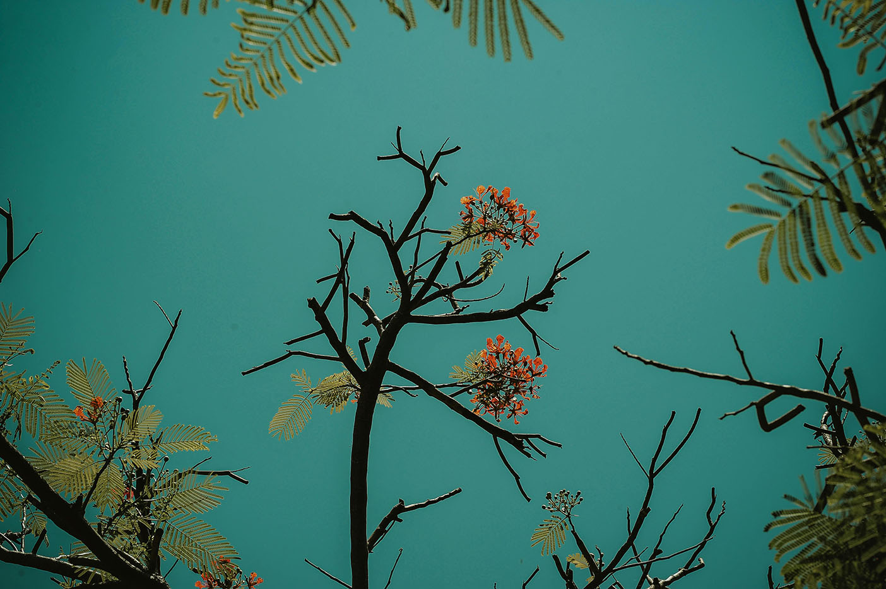

---
# 🖼️ Page Layout (DON'T CHANGE)
layout: page_projects.njk # Please don't change

# 📌 Project Title (will show up on the site)
title: Template Project

# ✏️ Subtitle / A one-line description of the project
subtitle: A medium sized template project. Truly avant-garde.

# ℹ️ Info Tag (extra detail, like "Installation", "Client Work", "Prototype"). Keep this short, usually 1–2 words
info: Template

# 📅 Year of the project (will show up on the site, does not affect sorting)
year: 2000

# 📆 Full Date (YYYY-MM-DD) / Exact date, will not show up on the site, only for sorting
# Tip: More recent projects show up first. If you've made some changes to a project or want it to show up first,
# you can write down a more recent date.
date: 2000-03-23

# 🖼️ Main image (will display on the grid and at the top of the project page)
# Write down the file name of the thumbnail, without extension (i.e. image, NOT image.png)
# ⚠️ Make sure you place your images in the 'assets' folder of their respective projects
thumbnail: example-landscape

# 💬 Image Alt Text (for accessibility) / Describe the image in plain words
imageAlt: a landscape picture of a rainbow

# 📏 Size of this project in the grid
# Options: small | medium | large
size: medium

# 🗂️ Categories (tags for filtering projects)
# Add or remove as needed, keep quotes & brackets, separate by commas (i.e. ["Category1", "Category2", "Category3"])
categories: ["Art", "Design"]
---

# 👋 Project Content

Write the main content for your project here using **Markdown**.  
[Check out the mardown cheatsheet](https://github.com/adam-p/markdown-here/wiki/Markdown-Cheatsheet)

This is where you can tell the story of your project.

## ✨ Example content

Here’s how you can add images (make sure they’re in the `assets` folder of this project):

**Image with caption:**

{.small}  
*Caption for this image*

**Bullet points:**
- Point one
- Point two

**Links:**

[Visit my website](https://example.com)

---

✏️ **Tips for editing:**
- Replace all example text with your own project details.
- Keep the format of the `---` block at the top (called "frontmatter") the same.
- Always put your images in the `assets` folder and reference them as `assets/your-image.jpg`.