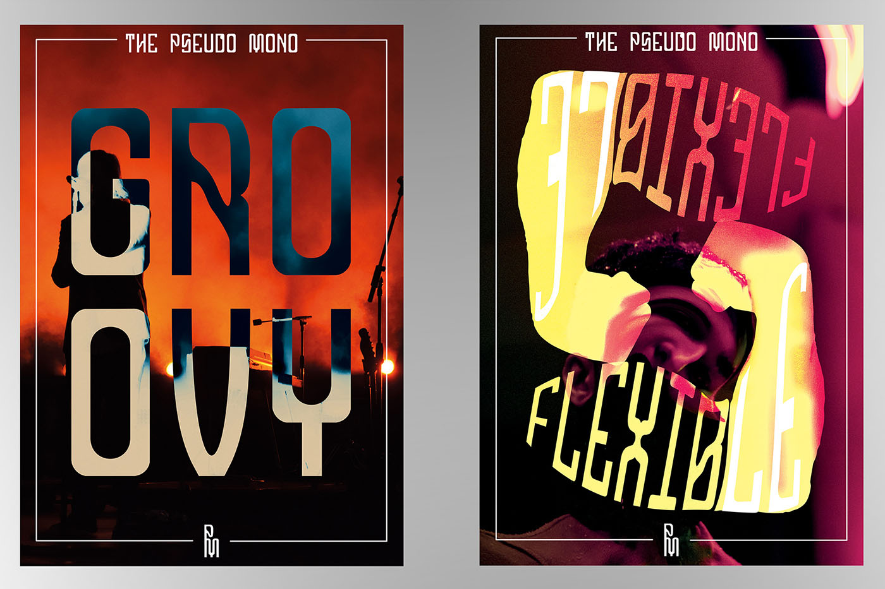
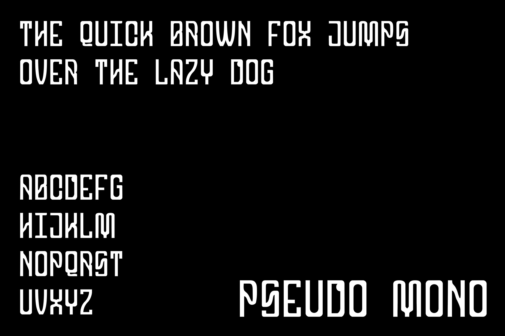

## Named after its almost monotype but not quite nature, Pseudo Mono is a headliner font inspired by the invention of the synthesiser, early electronic music cover art and the culmination of art and technology.

{.large}

{.extra-large}