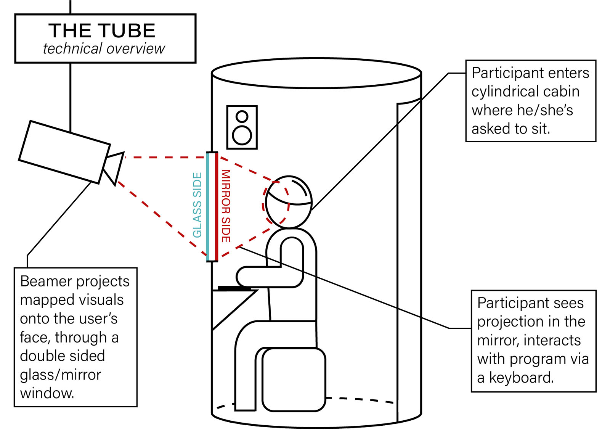

## Featured in the Stage21 exhibition, _the Tube_ acts as a phygital gatekeeper to the exhibition, inviting guests to step inside, scan themselves and access their tickets. 

<iframe src="https://player.vimeo.com/video/358266214?title=0&amp;byline=0&amp;portrait=0&amp;badge=0&amp;autopause=0&amp;player_id=0&amp;app_id=58479" frameborder="0" allow="autoplay; fullscreen; picture-in-picture; clipboard-write; encrypted-media; web-share" referrerpolicy="strict-origin-when-cross-origin" style="position:absolute;top:0;left:0;width:100%;height:100%;" title="The Tube"></iframe>

{.large}

Inside, a fake biometric scanning takes place through a projector hidden behind a mirror. As the scanning repeatedly 'fails,' the guest is guided by an ominous voice-over, prompting them to divulge increasingly personal data. No matter how far each person makes it, the scanning ultimately fails, questioning its user's humanity.

{.large}

After their experience, each visitor is given a certificate and asked to rate how likely they think such a scenario would be. _The Tube_ was made shortly after the Facebook-Cambridge Analytica data scandal, amidst growing concerns about the ownership and misuse of personal data. 