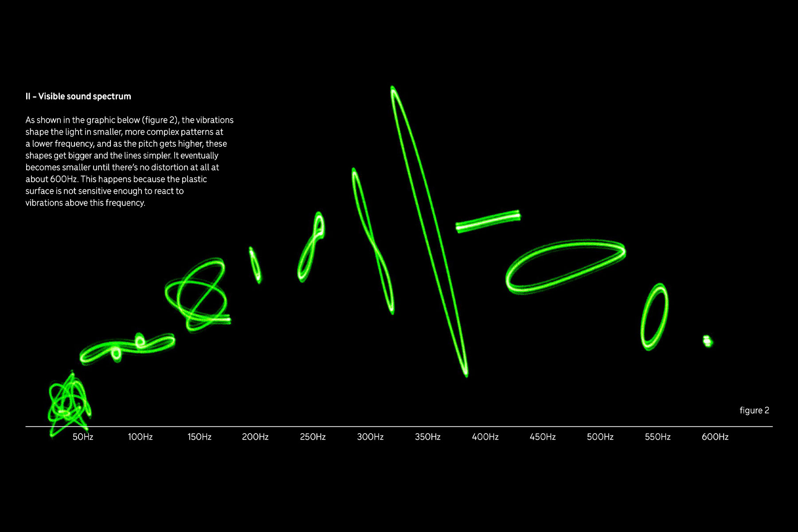
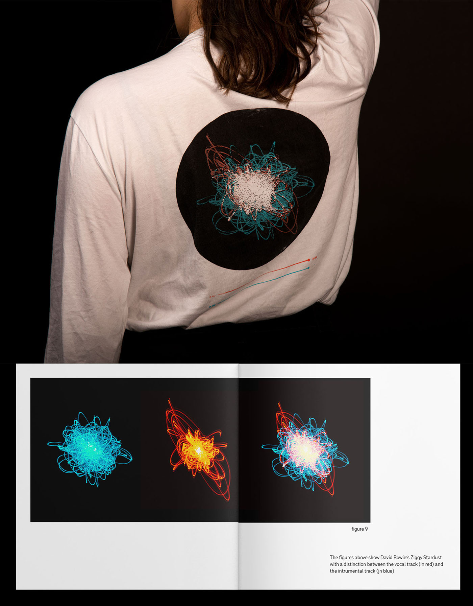
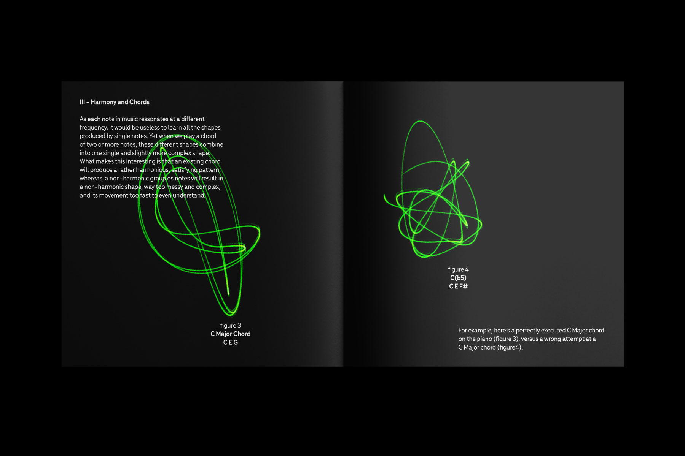

## These green scribbles carry a surprising load of information – they’re the vibrations of different sound frequencies affecting a laser pointer. _Cymatics_ arose from endless experiments with the shapes of sound. It explores ways to incorporate the physicality of sound in the world of music merchandising and composition.

{.large}

# Cymatics in merchandising

What we listen to can be made visible, not by an artist’s impression of the song, but by the sound waves themselves, unaffected by the subjectivity of the signs and symbols we currently use to depict music. _Cymatics_ builds a new design system around these sound visualisations. By capturing the vibrations caused by sound, we can create a literal light map – an image containing an entire audio piece.

{.medium}

Wearing the light map of an entire piece of music, a whole album, or just a fragment of a song offers the wearer the opposite of a Nirvana shirt from H&M. Instead, they get to wear a very personal signifier, a more intimate way to devote their fandom to their favourite artist.

# Cymatics in composition and interpretation

Studying cymatic shapes reveals that there’s a correlation between sonic harmony and visual harmony. A perfectly executed C Major chord will result in a rather harmonious, satisfying, slow-flowing figure. But playing the same notes half a tone too high, which breaks the harmony of the chord, results in a messy shape which moves too fast to understand. 

_Cymatics_ proposes a system in which these shapes are used to describe sound instead, or in accompaniment of, standard musical notation. This system can be applied to music learning, making use of the phenomenon of synesthesia to help musicians who are visual learners connect harmonic shapes to sounds. 

{.large}

In a further iteration of this project, this alternative writing system could find potential in the world of jazz improvisation (if you’re an interested improv musician, get in touch with me!), where the musician could interpret a song by playing to its cymatic movement instead of an actual music sheet.