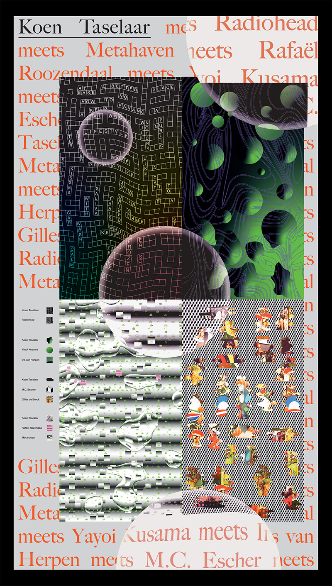

## Two posters made for the Fourteen Mirrors exhibition at the [Palace of Typographic Masonry](https://palaceoftypographicmasonry.nl/), one of them to promote the exhibition itself, made in collaboration with Nanco Speur, and another as an exhibition piece at the event, made with Annabel Kers, Reinier de Waal and Jessy Richter.

{.medium}