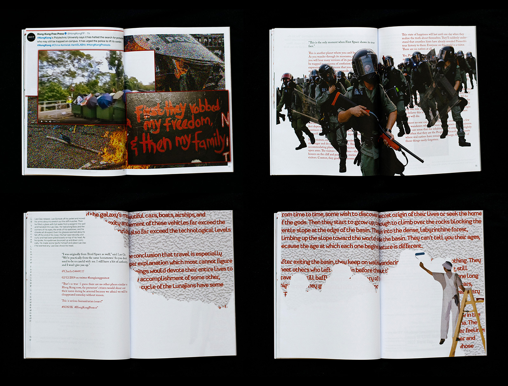

## _2019: A Media Space Odyssey_ is a tripartite anthology of fictional and real-world stories where the voices of minorities is questionably represented by digital media. 

{.extra-large}

This publication contrasts Hao Jinfang's sci-fi short stories _Invisible Planets_ and _Folding Beijing_ with online newspaper articles and social media posts depicting the 2019 Hong Kong protests, Chile's _Estallido Social_ (2019 – 2022) and Qatar's abuse of migrant workers ahead of the 2022 FIFA World Cup. Using overlapping design elements to censor some bodies of text and highlight others, this work challenges the politics and hierarchies behind (mis)information online.