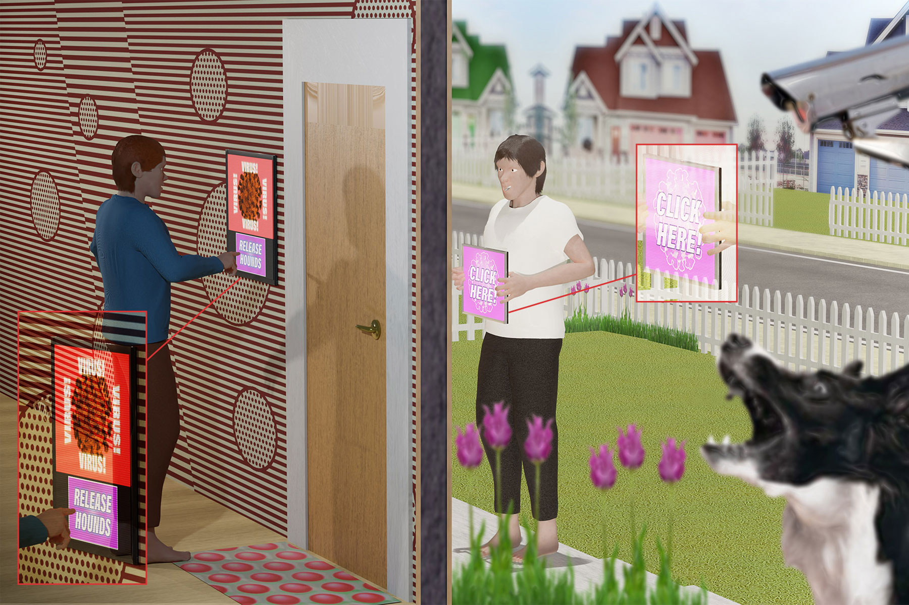
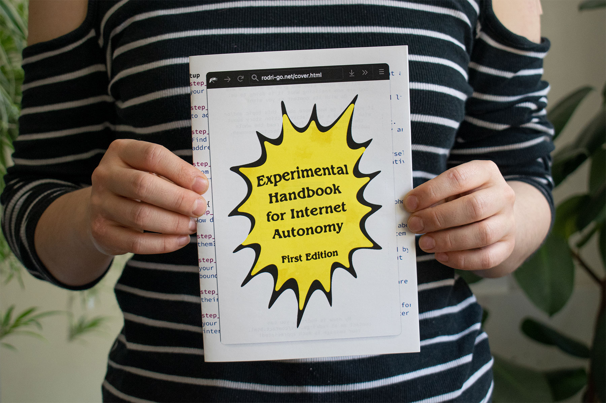

hi from autonomous web!

let's make page-size display!

and let's make the navbar not fixed in project page.

How can people self-govern their internet experience? How can they obtain autonomy from the internet while still being able to use it according to their needs?
These are the questions at the core of the Autonomous Web, an iterative series of digital and physical publications, which attempt to imagine alternatives to the current lack of autonomy on the internet.

The Autonomous Web project has taken part in ZineCamp Festival, Conversas and the WdKA Graduation Show.
Featured in Trade Plough online magazine and on wdka.nl.
Nominated for the 2021 WdKA Bachelor Research Award. 

# This is a h1

## this is a h2

### and a h3

And now we're going to write a little more, throw in some **bold** and *italic,* and paste an image right below this:

the image below should be extra large 

{.extra-large}

the image below should be large 

{.large}

this one medium

{.medium}

the next image should be small

{.small}

last one has no class 

seeing if this is in the same p as the image

another paragraph