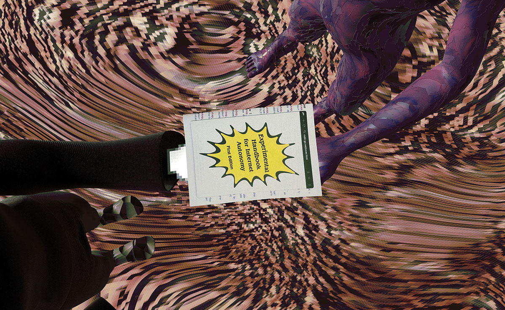

## How can people self-govern their internet experience? How can they obtain autonomy from the internet while still being able to use it according to their needs? These are the questions at the core of the _Autonomous Web_, a series of digital and physical publications, which attempt to imagine alternatives to the current lack of autonomy on the internet.

_The Autonomous Web_ project has taken part in [ZineCamp Festival](https://zinecamp2021.hotglue.me/?workshops), [Conversas](https://conversas.net) and the [WdKA Graduation Show](https://graduation.catalogue.wdka.nl/2021-rodrigo-cardoso/projects/autonomous-web/). Featured in [Trade Plough online magazine](https://www.tradeplough.com/episode-9.html) and in an interview at [wdka.nl](https://www.wdka.nl/alumni/the-autonomous-web). Nominated for the 2021 WdKA Bachelor Research Award.

{.large}

In its search for internet autonomy, this publication reimagines the web as two extreme versions of itself. An oppressive, alienating dystopia where users became enslaved by the web, and its polar opposite, a utopian realm where biological life and the autonomous internet exist in true cybernetic harmony.

{.large}

The negative story takes the form of a comic novel, examining how the internet cunningly takes away our freedom. In this world, which could be us in a not so distant future, people live in a zombie-like state. Constantly connected to their digital devices, that shun them from reality, they live and die as data generators for the Cloud.

The positive story is a catalogue of experiments, thoughts and behaviours focused on autonomy and the internet. It addresses the nasty aspects of the web as told in the pessimistic story. In doing so, it reimagines the internet as we know it as the speculative _Autonomous Web,_ an internet which is decentralised, where people have control over their own data, identity and actions, and where browsing is an embodied and often multi-user experience.

{.large}

The _Experimental Handbook for Internet Autonomy_ is a zine, which you can print or download [here](assets/experimental_handbook_for_internet_autonomy.pdf). As the physical counterpart of this publication, it takes the experiments and behaviours of _the Autonomous Web_ and turns them into executable ‘human algorithms’, making them tangible tools for collaborative (re)thinking about our relationship to the network.

