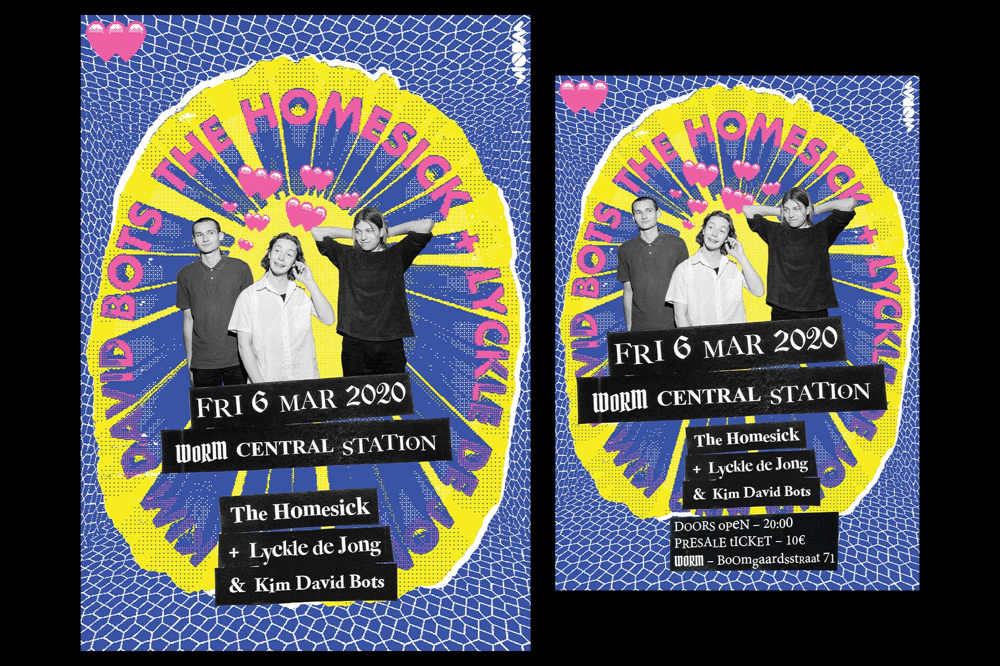

## Selection of print work done for WORM Rotterdam, including a full-length [magazine](https://issuu.com/wormrotterdam/docs/magazine_worm), promotional material (posters and flyers) and a series of zines. WORM makes it its mission to provide a stage for the counterculture and the under-represented people in art. By doing so, it boasts some of the most diversified and interesting line-ups in the city.

{.extra-large}

{.large}

{.large}

{.large}

{.large}

## Other work I've done for WORM: 
- [WORM Weekend Video Collection.](/projects/2020_worm_video)
- [WORMworld Website](/projects/2020_worm_world)

