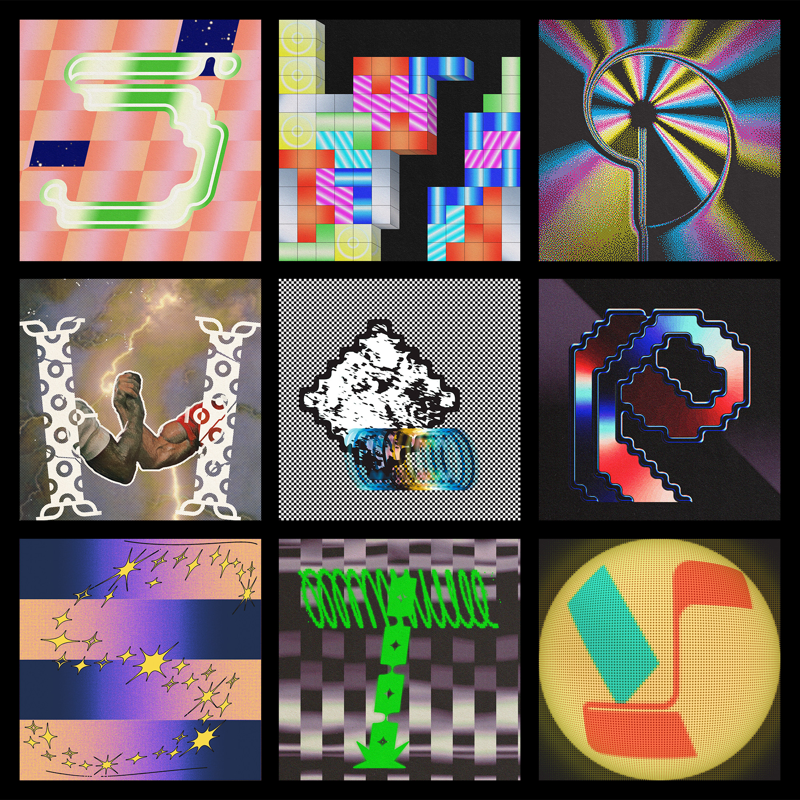

---
# 🖼️ Page Layout
layout: page_projects.njk

# 📌 Project Title
title: 36 Days of Type 2022

# ✏️ Subtitle / A one-line description of the project
subtitle: A character a day for 36 days.

# ℹ️ Info Tag (extra detail, like "Installation", "Client Work", "Prototype"). Keep this short, usually 1–2 words
info: Type

# 📅 Year of the project (will show up on site, does not affect sorting)
year: 2022

# 📆 Full Date (YYYY-MM-DD) / Exact date, will not show up on the site, only for sorting
# ⚠️ More recent projects show up first.
date: 2025-08-26

# 🖼️ Main image (will display on the grid and at the top of the project page)
# No need for file extension (i.e. image, NOT image.png)
# ⚠️ Place your images in the 'assets' folder of their respective projects
thumbnail: thumbnail

# 💬 Image Alt Text / Describe the image in plain words
imageAlt: View of four letters, spelling TYPE, on a black background.

# 📏 Size of this project in the grid
# Options: small | medium | large
size: small

# 🗂️ Categories (tags for filtering projects)
# Keep quotes & brackets, separate by commas (i.e. ["Category1", "Category2", "Category3"])
categories: ["Design", "Typography"]
---

## I joined the _36 Days of Type_ challenge, designing a character a day for 36 days. It was surprisingly fun and the priceless feeling of getting in a flow made it all worth it. Here are some of my favourite letters.

{.extra-large}