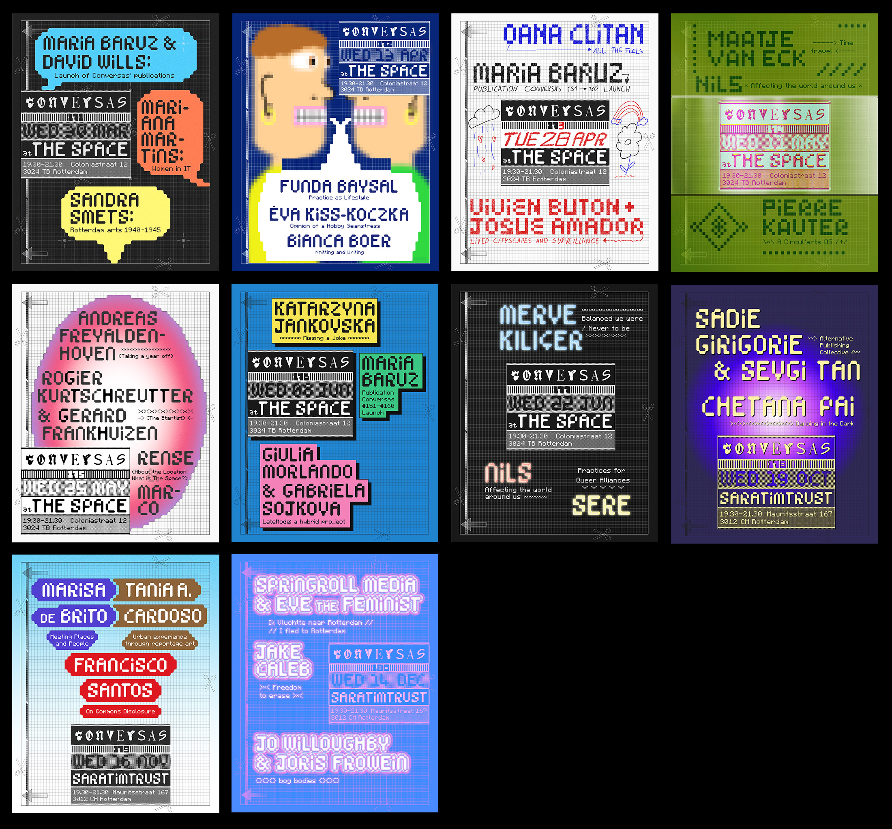
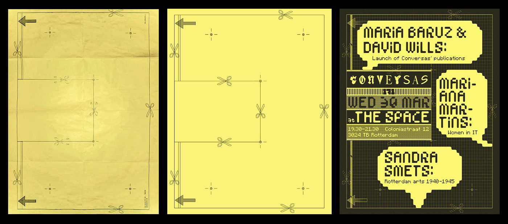

---
# 🖼️ Page Layout
layout: page_projects.njk

# 📌 Project Title
title: Conversas Rotterdam 171 – 180 Posters

# ✏️ Subtitle / A one-line description of the project
subtitle: Conversas is a series of monthly informal meetings to get to know each other and share projects, stories, or interests.

# ℹ️ Info Tag (extra detail, like "Installation", "Client Work", "Prototype"). Keep this short, usually 1–2 words
info: Event Posters

# 📅 Year of the project (will show up on site, does not affect sorting)
year: 2022

# 📆 Full Date (YYYY-MM-DD) / Exact date, will not show up on the site, only for sorting
# ⚠️ More recent projects show up first.
date: 2025-08-27

# 🖼️ Main image (will display on the grid and at the top of the project page)
# No need for file extension (i.e. image, NOT image.png)
# ⚠️ Place your images in the 'assets' folder of their respective projects
thumbnail: posters_thumbnail

# 💬 Image Alt Text / Describe the image in plain words
imageAlt: View of two event posters on a black background.

# 📏 Size of this project in the grid
# Options: small | medium | large
size: small

# 🗂️ Categories (tags for filtering projects)
# Keep quotes & brackets, separate by commas (i.e. ["Category1", "Category2", "Category3"])
categories: ["Design", "Poster"]
---

## _Conversas_ is a series of monthly informal meetings to get to know each other and share projects, stories, or interests. Each series of ten Conversas brings in a different designer for ten unique event posters and a [publication](projects/2025_conversas_publication).

{.extra-large}

_Conversas Rotterdam_ has made more than 180 gatherings in the city of Rotterdam. The 18th series of Conversas Rotterdam happened between March and December 2022 and was organised by Constança Saraiva, Silvija Almanaitytè, Shambhavi Bhat, Sebastian Helbers, and Maurice Suitela.

_Conversas_ is a project initiated in Lisbon by Constança Saraiva and Mafalda Fernandes in 2012. Nowadays, it's a project of many people and cities.

{.large}