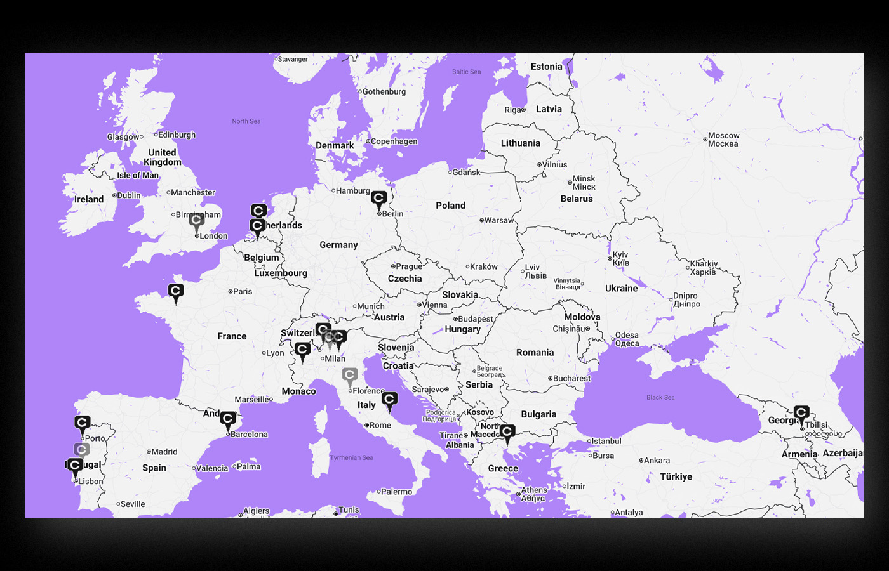
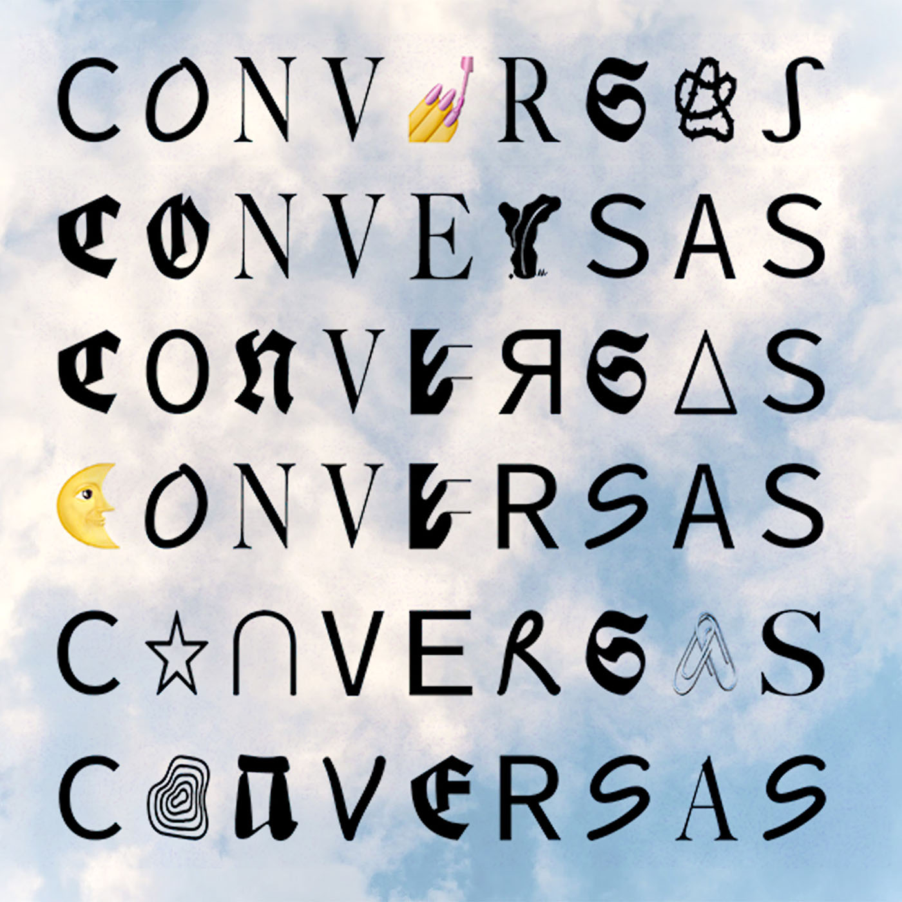

---
# 🖼️ Page Layout
layout: page_projects.njk

# 📌 Project Title
title: conversas.net

# ✏️ Subtitle / A one-line description of the project
subtitle: Connecting the many Conversas around the world.

# ℹ️ Info Tag (extra detail, like "Installation", "Client Work", "Prototype"). Keep this short, usually 1–2 words
info: Website

# 📅 Year of the project (will show up on site, does not affect sorting)
year: 2023

# 📆 Full Date (YYYY-MM-DD) / Exact date, will not show up on the site, only for sorting
# ⚠️ More recent projects show up first.
date: 2025-08-28

# 🖼️ Main image (will display on the grid and at the top of the project page)
# ⚠️ Place your images in the 'assets' folder of their respective projects
thumbnail: thumbnail.webp

# 💬 Image Alt Text / Describe the image in plain words
imageAlt: View of the website in both laptop and mobile formats. One sees the Conversas title followed by a menu and a list of existing Conversas in different cities.

# 📏 Size of this project in the grid
# Options: small | medium | large
size: small

# 🗂️ Categories (tags for filtering projects)
# Keep quotes & brackets, separate by commas (i.e. ["Category1", "Category2", "Category3"])
categories: ["Website", "Design", "Coding"]
---

## _Conversas_ is a volunteer-run project initiated in Lisbon in 2012 and now active in many cities around the world, autonomously organised by anyone who is inspired by the format. They host a series of open informal gatherings for the sharing and discussion of projects, ideas or stories in a non-hierarchical way.

I have been involved with _Conversas_ as a designer in various capacities (see the [publication](projects/2025_conversas_publication) and [event posters](projects/2022_conversas_posters) I made for _Conversas Rotterdam_), one of which was developing this platform that connects the many iterations of the project around the world.

{.large}

The website is centred around a map, showing each _Conversas_ project as a node in a broader network of self-initiated, place-based communities that share values and knowledge. The modular _Conversas_ title changes into a different assortment of drawings, symbols and typefaces, writing out the word differently each time the page is accessed. The ever-changing title reflects the project’s evolution into independently organised events, distancing it from strictly defined identities and ways of doing.

{.small}

## Other projects I've done for _Conversas_:

- [Conversas Rotterdam 171–180 Publication](/projects/2025_conversas_publication)
- [Conversas Rotterdam 171–180 Posters](/projects/2022_conversas_posters)