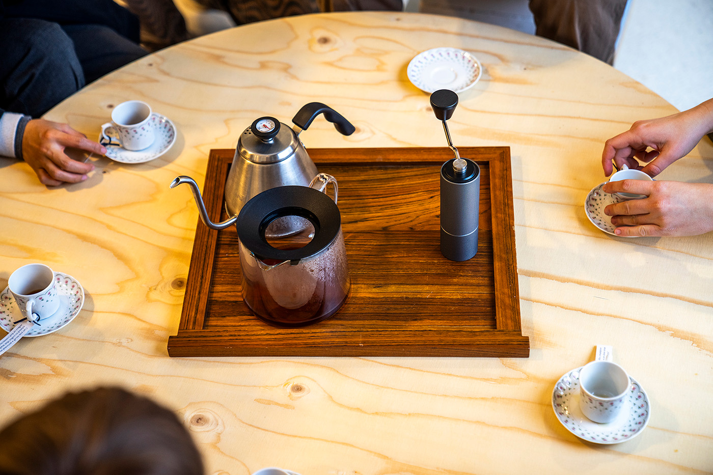
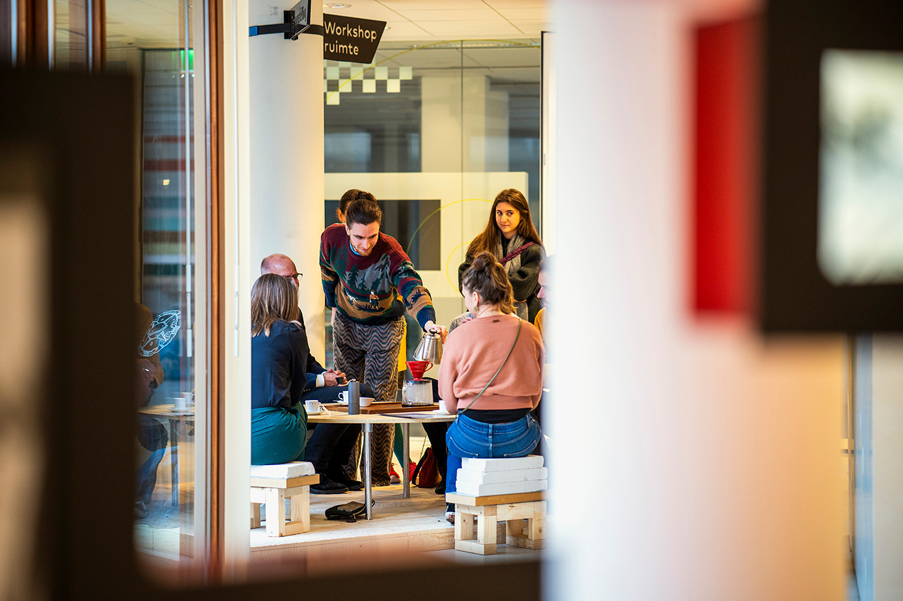

---
# 🖼️ Page Layout
layout: page_projects.njk

# 📌 Project Title
title: Reflective Coffee Corner

# ✏️ Subtitle / A one-line description of the project
subtitle: A space that invites critical thinking around coffee’s complex social and material entanglements with the world

# ℹ️ Info Tag (extra detail, like "Installation", "Client Work", "Prototype"). Keep this short, usually 1–2 words
info: Series of Workshops

# 📅 Year of the project (will show up on site, does not affect sorting)
year: 2024

# 📆 Full Date (YYYY-MM-DD) / Exact date, will not show up on the site, only for sorting
# ⚠️ More recent projects show up first.
date: 2025-09-01

# 🖼️ Main image (will display on the grid and at the top of the project page)
# ⚠️ Place your images in the 'assets' folder of their respective projects
thumbnail: serving.webp

# 💬 Image Alt Text / Describe the image in plain words
imageAlt: Medium shot of a group of 5 people sat around a low round table, smiling as coffee is prepared.

# 📏 Size of this project in the grid
# Options: small | medium | large
size: small

# 🗂️ Categories (tags for filtering projects)
# Keep quotes & brackets, separate by commas (i.e. ["Category1", "Category2", "Category3"])
categories: ["Workshop", "Research"]
---

## _Reflective Coffee Corner_ is a space that invites critical thinking around coffee’s complex social and material entanglements with the world, by means of a series of reflective, collaborative coffee servings. It took place in November 2024 in the _Dutch National Archive_, where one can read about the Dutch colonial coffee trade, during the _Archival Frictions_ exhibition aimed at questioning the colonial gaze that underpins the archive's material.

{.large}

The _Coffea Arabica_ plant was stolen by the Dutch East India Company (VOC) from the
port city of Mocha, Yemen, to be forcefully planted in the then Dutch-controlled island
of Java, giving European colonial powers a way into the coffee trade. 400 years later,
we can hear the echoes of this act of capitalist extractivism resonating in our modern
relationship with the caffeinated beverage.

The collaborative coffee servings create a moment for coffee to be reclaimed not as yet another quick-fix for productivity, but as an opportunity to gather around and share stories, sparking critical conversations about our relationship with it. During each serving, the brewing process is broken into stages and interwoven with re-tellings of the Dutch colonial history with coffee, informed by my own research in the National Archive, told from the perspective of the _Coffea Arabica_ plant herself, as a more-than-human entity.

{.large}

As they enjoy their carefully brewed coffee, each participant is invited to discuss a question attached to their coffee, fuelling the conversation further. The _Reflective Coffee Corner_ servings ran parallel to a [_A Reflective Cup of Coffee_](/projects/2025_reflective_cup_of_coffee), a video essay focused solely on the re-telling of coffee’s colonial history.