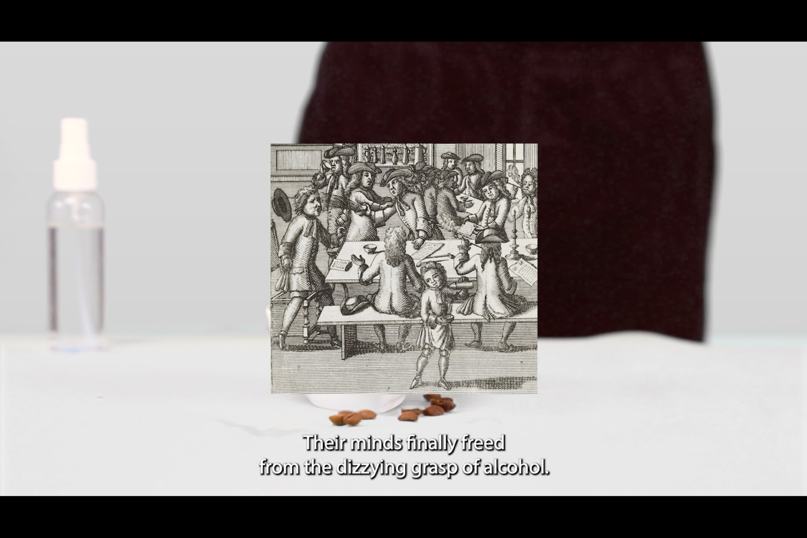

---
# 🖼️ Page Layout
layout: page_projects.njk

# 📌 Project Title
title: A Reflective Cup of Coffe

# ✏️ Subtitle / A one-line description of the project
subtitle: Coffee’s colonial history as told by Coffee, based on archival research.

# ℹ️ Info Tag (extra detail, like "Installation", "Client Work", "Prototype"). Keep this short, usually 1–2 words
info: Video Essay

# 📅 Year of the project (will show up on site, does not affect sorting)
year: 2024

# 📆 Full Date (YYYY-MM-DD) / Exact date, will not show up on the site, only for sorting
# ⚠️ More recent projects show up first.
date: 2025-08-31

# 🖼️ Main image (will display on the grid and at the top of the project page)
# No need for file extension (i.e. image, NOT image.png)
# ⚠️ Place your images in the 'assets' folder of their respective projects
thumbnail: video_thumbnail

# 💬 Image Alt Text / Describe the image in plain words
imageAlt: Stack of four identical black and white A5 magazines, each decorated with differently coloured stickers.

# 📏 Size of this project in the grid
# Options: small | medium | large
size: small

# 🗂️ Categories (tags for filtering projects)
# Keep quotes & brackets, separate by commas (i.e. ["Category1", "Category2", "Category3"])
categories: ["Video", "Writing", "Research"]
---

## _A Reflective Cup of Coffee_ is a video essay re-telling coffee’s colonial history from a first person point-of-view, as told by Coffee, the Goddess of wakefulness, in an effort to re-centre the more-than-human agent in this story. It was shown in November 2024 in the _Dutch National Archive,_ where one can read about the Dutch colonial coffee trade, during the _Archival Frictions_ exhibition aimed at questioning the colonial gaze that underpins the archive's material.

<iframe src="https://player.vimeo.com/video/1116551887?badge=0&amp;autopause=0&amp;player_id=0&amp;app_id=58479" frameborder="0" allow="autoplay; fullscreen; picture-in-picture; clipboard-write; encrypted-media; web-share" referrerpolicy="strict-origin-when-cross-origin" style="position:absolute;top:0;left:0;width:100%;height:100%;" title="A Reflective Cup of Coffee"></iframe>

This video essay is informed by my own research in the National Archive. One of the world's most successful plantations, coffee gets transported from the tropical highlands to the higher latitudes at great environmental cost only to be soaked in water and then discarded. Its growth relies largely on precarious workers in the Global South. From its sacred origin – coffee was first used by Yemenite Sufis as an aid for concentration during religious worship – it became synonymous with productivity, caffeine becoming the daily fuel for the workers of modern businesses. 

However, coffee has been and still is a powerful social bond. In early modern Europe, coffee houses were rare spaces where people across different social classes could meet and discuss politics, even becoming outlawed in places where they threatened institutional power. Many cultures around the world, especially those who grow coffee, have developed their own socially focused rituals around it. 

{.large}

_A Reflective Cup of Coffee,_ as well as its sister project [_Reflective Coffee Corner_](/projects/2025_reflective_coffee_corner), aim to reclaim coffee drinking as an opportunity to gather around and share stories, sparking critical conversations about our relationship with it.

### [Download the essay in written form (pdf file).](assets/reflective-cup-of-coffee.pdf)