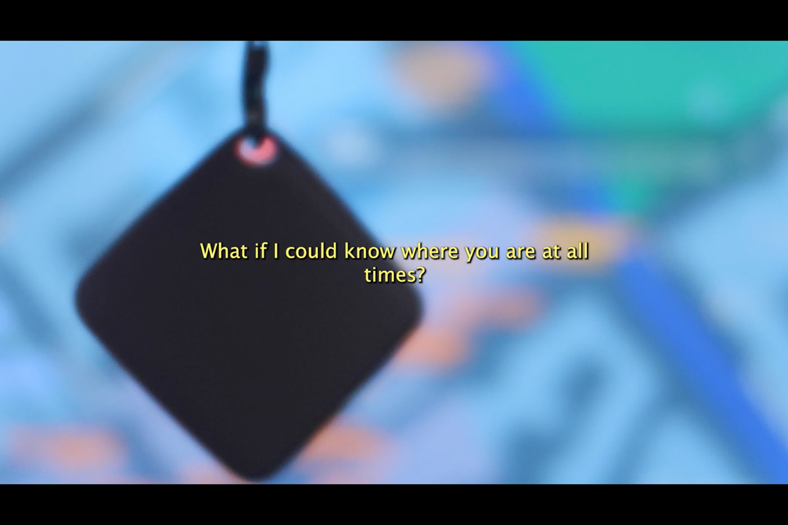
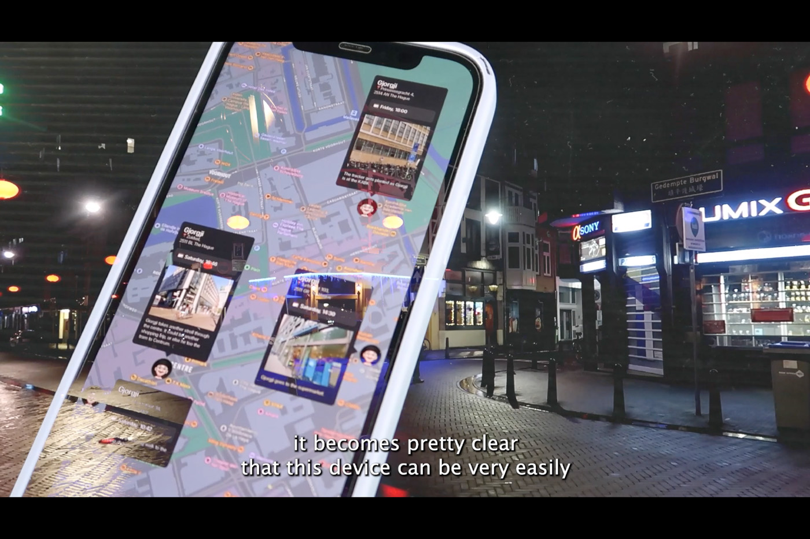

---
# 🖼️ Page Layout
layout: page_projects.njk

# 📌 Project Title
title: Weekend at Gjorgji's

# ✏️ Subtitle / A one-line description of the project
subtitle: What can I find out about you if I know where you are at all times? Investigating item trackers.

# ℹ️ Info Tag (extra detail, like "Installation", "Client Work", "Prototype"). Keep this short, usually 1–2 words
info: Video Essay

# 📅 Year of the project (will show up on site, does not affect sorting)
year: 2024

# 📆 Full Date (YYYY-MM-DD) / Exact date, will not show up on the site, only for sorting
# ⚠️ More recent projects show up first.
date: 2025-08-29

# 🖼️ Main image (will display on the grid and at the top of the project page)
# No need for file extension (i.e. image, NOT image.png)
# ⚠️ Place your images in the 'assets' folder of their respective projects
thumbnail: thumbnail

# 💬 Image Alt Text / Describe the image in plain words
imageAlt: Zoomed in, grainy view of a window at night, lit my blue and red lamps.

# 📏 Size of this project in the grid
# Options: small | medium | large
size: small

# 🗂️ Categories (tags for filtering projects)
# Keep quotes & brackets, separate by commas (i.e. ["Category1", "Category2", "Category3"])
categories: ["Video", "Coding", "Research"]
---

## What can I find out about you if I know where you are at all times? _Weekend at Gjorgji's_ confronts the misuse of so-called item trackers as a powerful out-of-the-box tool for stalkers. It was presented at the _Undercover_ exhibition, aimed at uncovering hidden narratives that are embedded into our everyday experiences surrounding technology.

<!-- 
<iframe src="https://player.vimeo.com/video/1116551887?badge=0&amp;autopause=0&amp;player_id=0&amp;app_id=58479" frameborder="0" allow="autoplay; fullscreen; picture-in-picture; clipboard-write; encrypted-media; web-share" referrerpolicy="strict-origin-when-cross-origin" style="position:absolute;top:0;left:0;width:100%;height:100%;" title="A Reflective Cup of Coffee"></iframe>
 -->

Conveniently priced at 6.95€, these coin-sized trackers were popularised by the Apple AirTag and have become widely available. Its small size and lack safety features make it dangerously easy for stalkers to plant them on a victim and track them without them knowing. As technology makers and consumers, we are often confronted with a choice between privacy and convenience. Once again, we chose convenience. 

{.large}

Using an item tracker to monitor his location, I retrace the steps of my friend Gjorgji for a weekend, who kindly consented to this experiment, learning about his habits and the places where he is the most vulnerable at. 

{.large}

Thanks to a simple piece of custom software, I was able to log his location at regular intervals, building a map of his locations over time. _Weekend at Gjorgji's_ exposes the many documented cases of stalking enabled by item trackers and documents my experiments in circumventing their weak safety mechanisms.