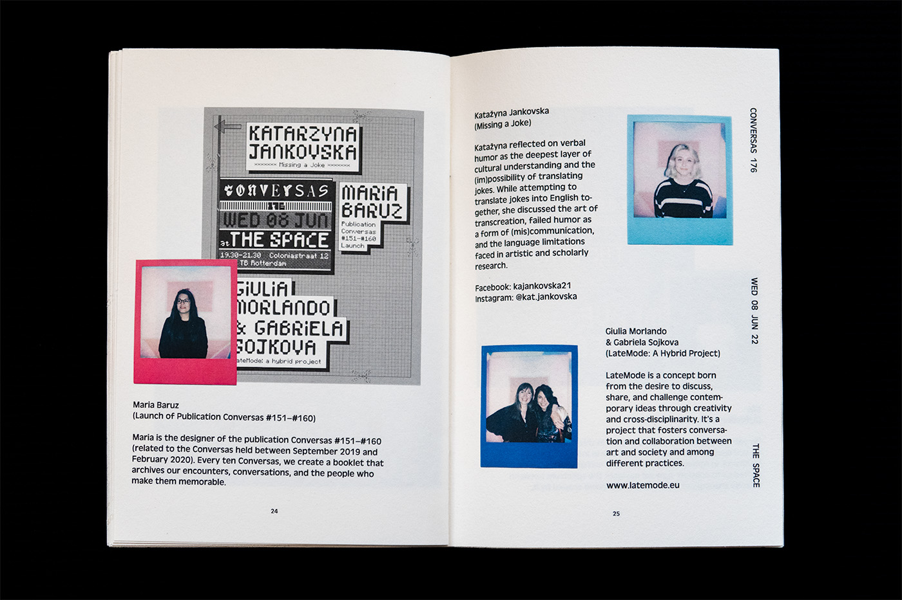
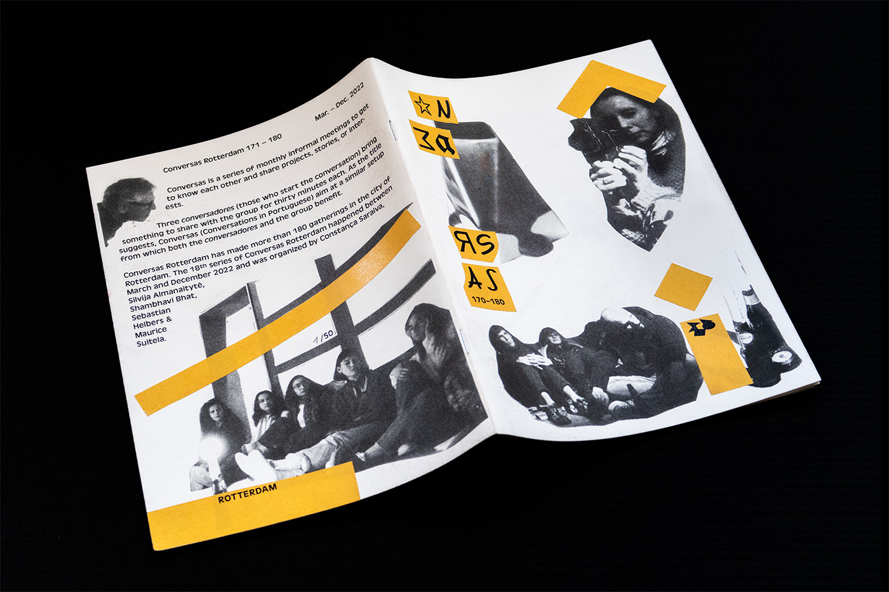
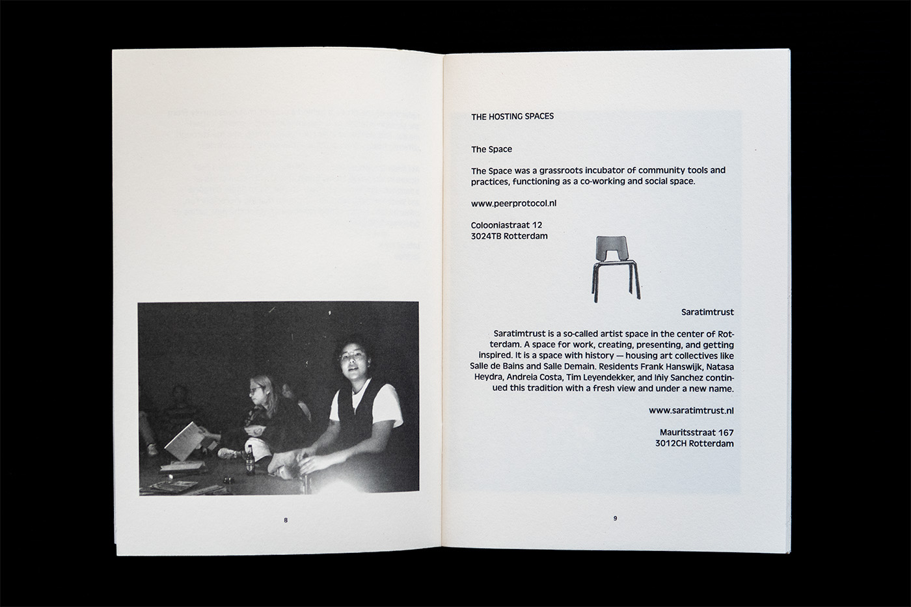

---
# 🖼️ Page Layout
layout: page_projects.njk

# 📌 Project Title
title: Conversas Rotterdam 171 – 180 Publication

# ✏️ Subtitle / A one-line description of the project
subtitle: Conversas give way to hopeful conversations on how we can do things differently.

# ℹ️ Info Tag (extra detail, like "Installation", "Client Work", "Prototype"). Keep this short, usually 1–2 words
info: Publication

# 📅 Year of the project (will show up on site, does not affect sorting)
year: 2025

# 📆 Full Date (YYYY-MM-DD) / Exact date, will not show up on the site, only for sorting
# ⚠️ More recent projects show up first.
date: 2025-09-03

# 🖼️ Main image (will display on the grid and at the top of the project page)
# ⚠️ Place your images in the 'assets' folder of their respective projects
thumbnail: stack.webp

# 💬 Image Alt Text / Describe the image in plain words
imageAlt: Stack of four identical black and white A5 magazines, each decorated with differently coloured stickers.

# 📏 Size of this project in the grid
# Options: small | medium | large
size: small

# 🗂️ Categories (tags for filtering projects)
# Keep quotes & brackets, separate by commas (i.e. ["Category1", "Category2", "Category3"])
categories: ["Design", "Publication"]
---

## _Conversas_ is a series of monthly informal meetings to get to know each other and share projects, stories, or interests. Each series of ten _Conversas_ is documented in a printed publication.
 

Bottom-up, self-organised, and DIY projects such as _Conversas_ give way to hopeful conversations on how we can do things differently – be that about navigating complex socio-political issues, finding identity and community in shared practices, or fostering understanding through embracing the quirks of miscommunication (all topics brought up during this series of _Conversas_.) These conversations, made possible by the wonderful group of speakers, active listeners, and organisers who make it all happen, emphasise a diversity of practices and ways of knowing that inform them and allow them to speak to each other unconstrained by the strict hierarchies that shape many forms of public speaking.

{.large}

It is important that such initiatives are properly documented and archived. This process allows a small project, organised locally by a team of volunteers, to become a node in a broader network of self-initiated, place-based communities that share values and knowledge, as we can see in the now global network of _Conversas_. I see the making of this publication – as well as the [event posters](/projects/2022_conversas_posters) and the [_Conversas_ website](/projects/2023_conversas_website) – as my modest contribution to that effort.

{.large}

Designing for such a project comes with the privilege of being playful. From the _Conversas_ 'logo,' which refuses a fixed form, to the posters, built on a grid system found on an IKEA instructions manual, and this publication, which occasionally borrows from punk collages while trying to give plenty of room to the many Conversadores who compose it, as well as Sebastiaan Helber’s incredible analogue photography, the work I have done for Conversas stubbornly avoids a cohesive visual style. 

This is much to my pleasure, though perhaps to the frustration of fellow graphic designers reading this. It is not a bold artistic statement or even an intentional choice, but rather a reflection of the process behind a project that lives purely from the genuine interest of those involved in it – messy, experimental, and scattered over four years, which saw me through different homes, jobs, studies, cities and even countries.

{.large}

_Conversas Rotterdam_ has made more than 180 gatherings in the city of Rotterdam. The 18th series of Conversas Rotterdam happened between March and December 2022 and was organised by Constança Saraiva, Silvija Almanaitytè, Shambhavi Bhat, Sebastian Helbers, and Maurice Suitela.

_Conversas_ is a project initiated in Lisbon by Constança Saraiva and Mafalda Fernandes in 2012. Nowadays, it's a project of many people and cities. 

## Other projects I've done for _Conversas_:

- [Conversas.net Website](/projects/2023_conversas_website)
- [Conversas Rotterdam 171–180 Posters](/projects/2022_conversas_posters)