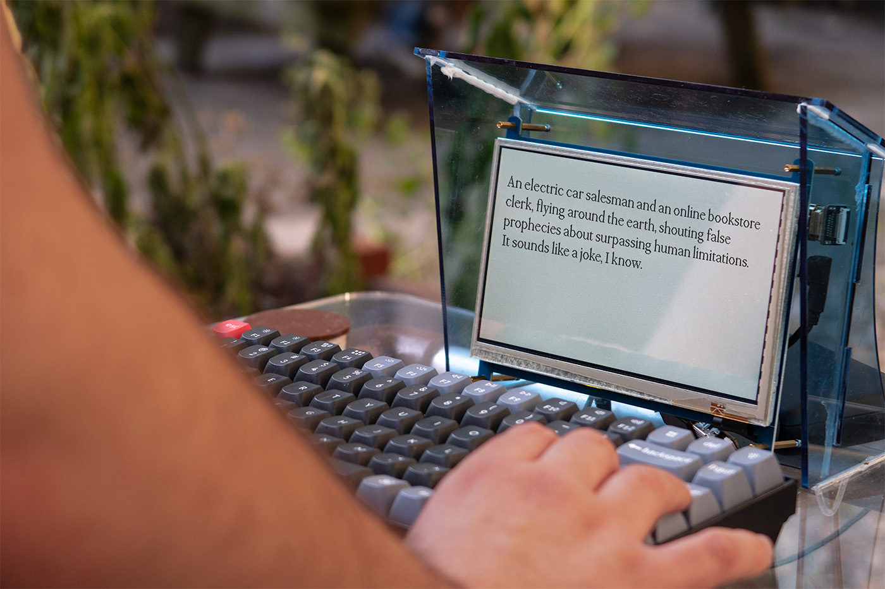
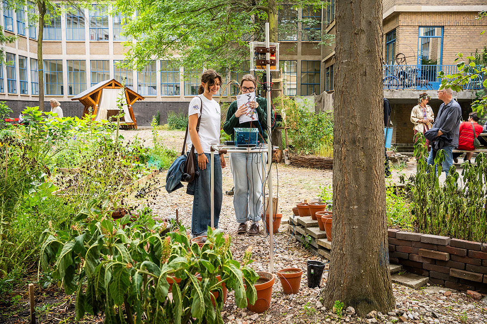
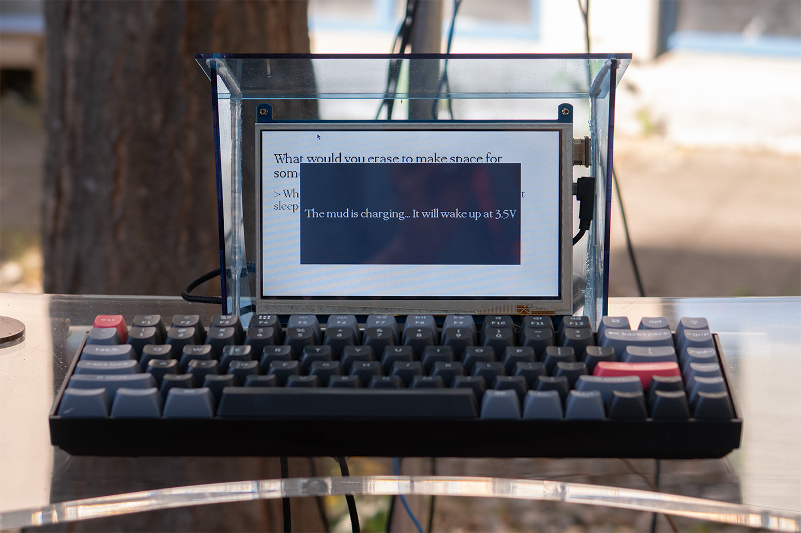
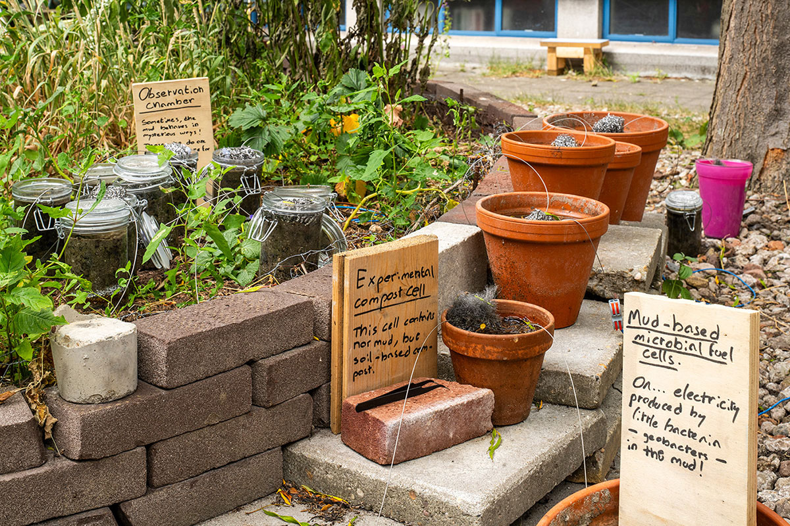
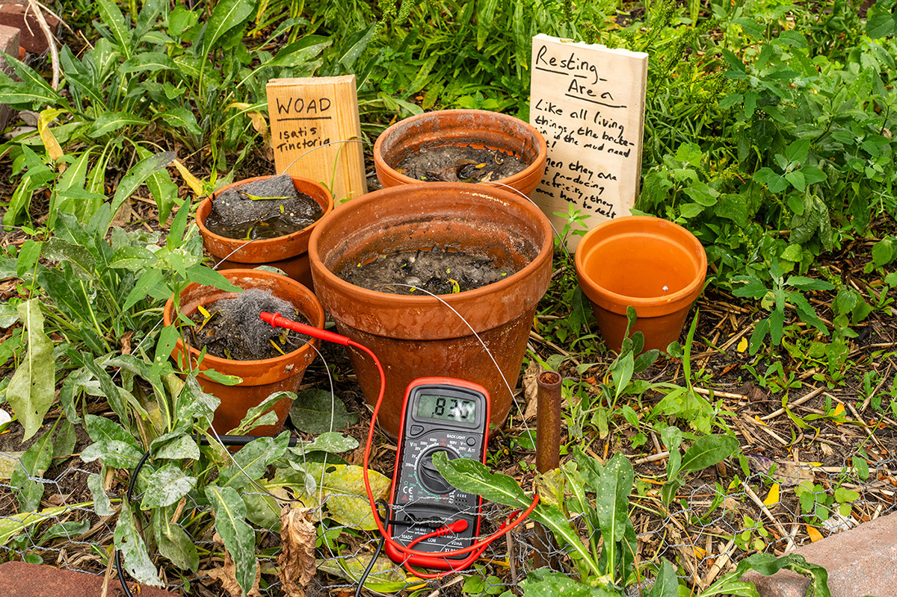
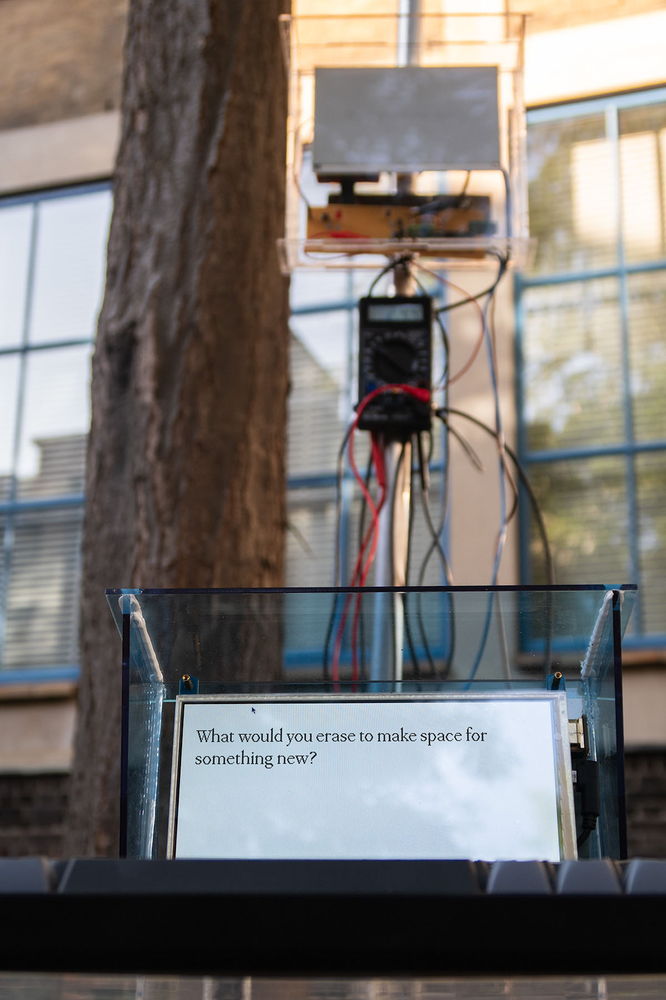

---
# 🖼️ Page Layout
layout: page_projects.njk

# 📌 Project Title
title: Decaying Data

# ✏️ Subtitle / A one-line description of the project
subtitle: What if the internet needs a nap, but we won't let it sleep?

# ℹ️ Info Tag (extra detail, like "Installation", "Client Work", "Prototype"). Keep this short, usually 1–2 words
info: Energy-responsive Installation

# 📅 Year of the project (will show up on site, does not affect sorting)
year: 2025

# 📆 Full Date (YYYY-MM-DD) / Exact date, will not show up on the site, only for sorting
# ⚠️ More recent projects show up first.
date: 2025-09-05

# 🖼️ Main image (will display on the grid and at the top of the project page)
# ⚠️ Place your images in the 'assets' folder of their respective projects
thumbnail: thumbnail.webp

# 💬 Image Alt Text / Describe the image in plain words
imageAlt: A circuit box and an electronic ink screen inside a transparent enclosure. On the screen, barely readable, one can see the leftovers of a faded message - my guilty conscience.

# 📏 Size of this project in the grid
# Options: small | medium | large
size: medium

# 🗂️ Categories (tags for filtering projects)
# Keep quotes & brackets, separate by commas (i.e. ["Category1", "Category2", "Category3"])
categories: ["Installation", "Research", "Coding", "Electronics"]
---

## _Decaying Data_ is an interactive installation exploring the ecological cost and permanence of digital data. Visitors are invited to have a conversation with an old, neglected computer who is in a downsizing journey. 

{.large}

As their conversation comes to an end, they are asked to give away a small piece of personal data: a word, a thought, a memory, a lie... Their message is temporarily stored and displayed, as would happen in a computer server, but only as enough energy is available.

{.medium}

The installation is controlled by a series of mud-based microbial fuel cells – electricity derived from bacteria in the soil – which power an electronic switch. When the mud cells reach a certain charge, the switch activates, allowing new data to be processed. As the mud cells recharge, the displayed data decays until it has been erased from the server and screen. After this slow, organic erasure, the cycle can begin again.

{.medium}

{.medium}

{.medium}

_Decaying Data_ proposes that increases in energy efficiency, including 'green growth' narratives, will only matter if coupled with extensive cutbacks in consumption. As such, a meaningful ecological transition requires a substantial behavioural change, shifting us away from the growing demand for energy-intensive and environmentally-damaging technologies. The installation offers a physical alternative to the myth of the immaterial 'cloud', inviting digital degrowth and the radical act of deletion.  

{.small}

The microbial fuel cells and energy-harvesting electronics draw on Sunjoo Lee’s research developed during her project [_Electric Garden_](https://sunjoolee.com/Electric-Garden). _Decaying Data_ was exhibited in the [2025 KABK Graduation Show](https://graduation.kabk.nl/2025/rodrigo-cardoso) and builds on the theoretical framework formulated in my masters thesis [_Fungal Tech_](/projects/2025_fungal_tech/).