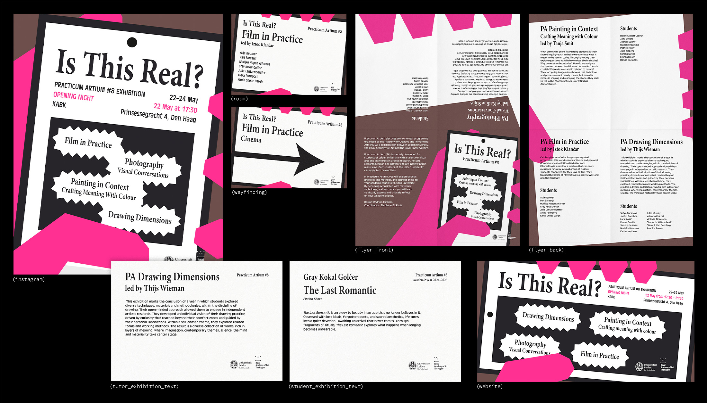

---
# 🖼️ Page Layout
layout: page_projects.njk

# 📌 Project Title
title: Is This Real?

# ✏️ Subtitle / A one-line description of the project
subtitle: Visual identity for Practicum Artium 8.

# ℹ️ Info Tag (extra detail, like "Installation", "Client Work", "Prototype"). Keep this short, usually 1–2 words
info: Graphic Design

# 📅 Year of the project (will show up on site, does not affect sorting)
year: 2025

# 📆 Full Date (YYYY-MM-DD) / Exact date, will not show up on the site, only for sorting
# ⚠️ More recent projects show up first.
date: 2025-09-02

# 🖼️ Main image (will display on the grid and at the top of the project page)
# ⚠️ Place your images in the 'assets' folder of their respective projects
thumbnail: insta-bg.webp

# 💬 Image Alt Text / Describe the image in plain words
imageAlt: Poster announcing event, showing the title "Is This Real" stylised as a newspaper article on a smartphone screen.

# 📏 Size of this project in the grid
# Options: small | medium | large
size: small

# 🗂️ Categories (tags for filtering projects)
# Keep quotes & brackets, separate by commas (i.e. ["Category1", "Category2", "Category3"])
categories: ["Design", "Identity", "Poster"]

imageClass: narrow
---

## _Practicum Artium_ electives are a one-year programme organised by the Academy of Creative and Performing Arts (ACPA), a collaboration between Leiden University, the Royal Academy of Art (KABK) and the Royal Conservatoire (KC). I designed the visual identity and promotional material for their 8th edition end-of-year exhibition, _Is This Real,_ showcasing student work from painting, drawing, film and photography classes.

{.extra-large}

